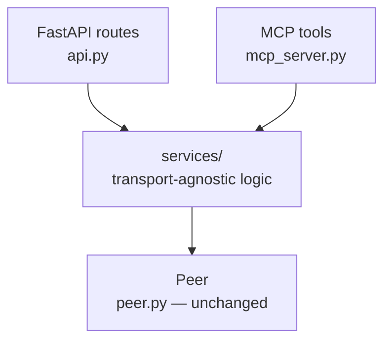

# py-ipfs-lite: service layer + MCP server plan

This document is grounded in the actual current state of `py_ipfs_lite/api.py`,
`peer.py`, `exceptions.py`, `cli.py`, and `tests/test_api.py` — not a generic
template. Names, methods, and test conventions below match the real code.

## 1. Why

`py_ipfs_lite/api.py` (600 lines, ~20 routes) currently mixes three things in
every handler:

1. **Transport mechanics** — temp-file buffering for uploads, a streaming
   generator for downloads, multipart-vs-raw-body parsing, JSON/CBOR content
   negotiation.
1. **Business logic** — calls into `Peer` (`add_file`, `get_node`, `add_pin`,
   `gc`, ...), plus some logic that isn't in `Peer` at all yet, like the
   repo-size loop in `repo_stat`.
1. **Error translation** — nearly every handler repeats the same
   `isinstance(e, (ValueError, TypeError, json.JSONDecodeError, RecursionError))`
   → 400 boilerplate, even though there's already a clean centralized
   `@app.exception_handler(IPFSLiteError)` for the domain exceptions in
   `exceptions.py`.

Two specific things make this worse once an MCP server exists:

- **Four endpoints reach past `Peer`'s public API into private internals**:
  `swarm_peers` and `debug_conns` use `peer.host.get_network().connections`,
  `debug_peerstore` uses `peer.host._host.get_peerstore()`, and
  `debug_routing_table` uses `peer.routing._routing.routing_table`. If an MCP
  tool needs the same data, it either duplicates these private reaches or
  imports from `api.py` directly. Given that connection-manager and
  routing-table internals have already shifted under you once, one canonical
  wrapper is worth more here than almost anywhere else in the file.
- **`add_file`/`cat_file` assume an HTTP request/response** (temp files,
  `StreamingResponse`) that an MCP tool call doesn't have — MCP needs a
  buffered variant, not a live stream.

The fix: pull everything in bucket (2) — and the swarm/private-internals
wrapping — into a `services/` package that knows nothing about FastAPI or MCP.
Both adapters become thin translators over the same calls.

## 2. Target architecture



`Peer` already exposes a clean async API (`add_file`, `get_file`, `add_node`,
`get_node`, `remove_node`, `add_pin`, `remove_pin`, `list_pins`, `gc`,
`resolve_name`, `publish_name`, `export_car`, `import_car`, `has_block`) — it
does **not** need to change. The gap is entirely between `Peer` and the HTTP
layer.

## 3. What moves where

| Current `api.py` handler(s)                                            | New home                                                        | Notes                                                                                                                                       |
| ---------------------------------------------------------------------- | --------------------------------------------------------------- | ------------------------------------------------------------------------------------------------------------------------------------------- |
| `add_file`                                                             | `services/files_service.py: add_file_from_stream`               | temp-file buffering moves with it                                                                                                           |
| `cat_file`                                                             | `services/files_service.py: get_file_stream` / `get_file_bytes` | streaming flavor for HTTP, buffered flavor for MCP                                                                                          |
| `dag_put`                                                              | `services/dag_service.py: put_node`                             | raw-body → Python object parsing stays in `api.py` (HTTP-specific); catches `RecursionError` → `DagTooDeepError`                            |
| `dag_get`                                                              | `services/dag_service.py: get_node`                             | wire encoding (JSON/CBOR/raw + `Accept` header) stays in `api.py`; `DAGJSONEncoder` moves to `services/dag_encoding.py` so MCP can reuse it |
| `block_stat`, `block_rm`                                               | `services/block_service.py`                                     | `parse_cid` failures wrapped as `InvalidCidError`                                                                                           |
| `pin_add`, `pin_rm`, `repo_gc`                                         | `services/pin_service.py`                                       |                                                                                                                                             |
| `name_publish`, `name_resolve`                                         | `services/naming_service.py`                                    |                                                                                                                                             |
| `repo_stat`, `repo_version`, `refs_local`                              | `services/repo_service.py`                                      | the repo-size loop is real logic, not a route concern                                                                                       |
| `swarm_peers`, `debug_conns`, `debug_peerstore`, `debug_routing_table` | `services/swarm_service.py`                                     | the *only* module allowed to touch `peer.host._host` / `peer.routing._routing`                                                              |
| `api_id`, `api_version`                                                | `services/node_service.py`                                      | trivial, but centralized so MCP doesn't reimplement                                                                                         |
| `debug/metrics/prometheus`                                             | stays in `api.py`                                               | Prometheus text format is HTTP-specific; connection counting moves to `swarm_service.count_connections`                                     |

Not currently exposed via HTTP but already on `Peer` (`export_car`,
`import_car`, `CarParseError`): when you get to CAR endpoints, the same
pattern applies — a `services/car_service.py`.

## 4. New/changed exceptions

`exceptions.py` already has a good base (`IPFSLiteError`, `BlockNotFoundError`,
`PinNotFoundError`, `PinError`, `PeerNotStartedError`, `RoutingError`,
`CarParseError`) and `api.py` already centralizes their → HTTP-status mapping
in one `exception_handler`. Add three more so the remaining ad-hoc
`isinstance` checks can go away:

```python
# exceptions.py additions

class InvalidCidError(IPFSLiteError):
    """Raised when a CID/path string cannot be parsed."""
    pass


class DagTooDeepError(IPFSLiteError):
    """Raised when a DAG node's structure exceeds a safe recursion depth."""
    pass


class PayloadTooLargeError(IPFSLiteError):
    """Raised when an upload or download exceeds the configured size limit."""
    pass
```

And extend the existing handler in `api.py`:

```python
@app.exception_handler(IPFSLiteError)
async def ipfs_lite_exception_handler(request: Request, exc: IPFSLiteError) -> Any:
    status_code = 500
    if isinstance(exc, (BlockNotFoundError, PinNotFoundError, RoutingError)):
        status_code = 404
    elif isinstance(exc, PeerNotStartedError):
        status_code = 503
    elif isinstance(exc, PinError):
        status_code = 409
    elif isinstance(exc, (CarParseError, InvalidCidError, DagTooDeepError)):
        status_code = 400
    elif isinstance(exc, PayloadTooLargeError):
        status_code = 413
    return JSONResponse(status_code=status_code, content={"detail": str(exc)})
```

Worth noting: a good chunk of the current `ValueError`/`TypeError`/
`JSONDecodeError` boilerplate exists because raw HTTP bodies are untyped bytes
that `api.py` has to `json.loads()` itself. MCP tool arguments are already
schema-validated by the MCP framework before your tool function runs, so that
specific class of error mostly disappears on the MCP side for free — one more
reason to keep body-parsing in `api.py` rather than pushing it into the
service layer.

## 5. File structure

```
py_ipfs_lite/
  peer.py                  # unchanged
  exceptions.py            # + InvalidCidError, DagTooDeepError, PayloadTooLargeError
  services/
    __init__.py
    files_service.py        # add_file_from_stream, get_file_stream, get_file_bytes
    dag_service.py           # put_node, get_node
    dag_encoding.py           # DAGJSONEncoder (moved from api.py, shared)
    block_service.py          # stat_block, remove_block
    pin_service.py             # add_pin, remove_pin, list_pins, run_gc
    naming_service.py           # publish_name, resolve_name
    repo_service.py              # get_repo_stat, get_repo_version, list_local_refs
    swarm_service.py              # list_connected_peers, count_connections,
                                   # list_peerstore_peers, list_routing_table_peers
    node_service.py                # get_identity, get_version_info
  api.py                    # trimmed to routing + HTTP mechanics only
  mcp_server.py             # new — thin MCP tool adapter over services/
  cli.py                    # + --mcp branch alongside the existing --api branch
tests/
  test_api.py               # unchanged — becomes your HTTP-layer regression suite
  services/
    test_files_service.py
    test_dag_service.py
    test_pin_service.py
    test_swarm_service.py
    ...
  test_mcp_server.py        # new
```

## 6. File contents

These are skeletons to adapt, not copy-paste-final code — but every function
name, exception, and `Peer` method below is real.

### `services/files_service.py`

```python
"""Add/cat operations. Handles upload buffering and download streaming so
neither FastAPI nor MCP has to."""

import os
import tempfile
from collections.abc import AsyncIterator
from dataclasses import dataclass

from py_ipfs_lite.exceptions import PayloadTooLargeError
from py_ipfs_lite.peer import Peer


@dataclass
class AddFileResult:
    name: str
    cid: str
    size: int


async def add_file_from_stream(
    peer: Peer,
    filename: str,
    chunks: AsyncIterator[bytes],
    max_size: int | None = None,
) -> AddFileResult:
    max_size = max_size or getattr(peer.config, "max_upload_size", 100 * 1024 * 1024)
    fd, path = tempfile.mkstemp()
    size = 0
    try:
        with os.fdopen(fd, "wb") as f:
            async for chunk in chunks:
                size += len(chunk)
                if size > max_size:
                    raise PayloadTooLargeError(f"upload exceeded {max_size} bytes")
                f.write(chunk)
        cid_str = await peer.add_file(path)
        return AddFileResult(name=filename, cid=cid_str, size=size)
    finally:
        os.remove(path)


async def get_file_stream(
    peer: Peer, cid_or_path: str, max_size: int | None = None
) -> AsyncIterator[bytes]:
    """Used by FastAPI's StreamingResponse."""
    max_size = max_size or getattr(peer.config, "max_download_size", 100 * 1024 * 1024)
    content_iter = await peer.get_file(cid_or_path, stream=True)
    size = 0
    async for chunk in content_iter:
        size += len(chunk)
        if size > max_size:
            raise PayloadTooLargeError(f"download exceeded {max_size} bytes")
        yield chunk


async def get_file_bytes(
    peer: Peer, cid_or_path: str, max_size: int | None = None
) -> bytes:
    """Buffered fetch — used by adapters (like MCP) that need one blob."""
    buf = bytearray()
    async for chunk in get_file_stream(peer, cid_or_path, max_size):
        buf.extend(chunk)
    return bytes(buf)
```

### `services/dag_service.py`

```python
"""Generic DAG node put/get. Wire encoding stays in the adapter."""

from dataclasses import dataclass
from typing import Any

from py_ipfs_lite.exceptions import DagTooDeepError
from py_ipfs_lite.peer import Peer, parse_cid


@dataclass
class DagPutResult:
    cid: str


async def put_node(peer: Peer, node_data: Any, codec: str = "dag-json") -> DagPutResult:
    try:
        cid_str = await peer.add_node(node_data, codec=codec)
    except RecursionError as e:
        raise DagTooDeepError("DAG node exceeds maximum nesting depth") from e
    return DagPutResult(cid=cid_str)


@dataclass
class DagGetResult:
    cid_codec: str        # "raw", "dag-cbor", "dag-json", ...
    node_data: Any          # decoded node — adapter decides how to put it on the wire


async def get_node(peer: Peer, cid_or_path: str) -> DagGetResult:
    cid = parse_cid(cid_or_path)
    node_data = await peer.get_node(cid_or_path)
    return DagGetResult(cid_codec=cid.codec, node_data=node_data)
```

### `services/dag_encoding.py`

```python
"""DAG-JSON encoding shared by the FastAPI dag/get route and any MCP tool
that returns DAG nodes. Moved out of api.py verbatim — same behavior."""

import base64
import json
from typing import Any


class DAGJSONEncoder(json.JSONEncoder):
    def default(self, obj: Any) -> Any:
        if isinstance(obj, bytes):
            return {"/": {"bytes": base64.b64encode(obj).decode("ascii")}}

        obj_type = type(obj).__name__

        if obj_type == "CBORTag" and getattr(obj, "tag", None) == 42:
            from py_ipfs_lite.peer import format_cid_for_display, parse_cid

            cid_bytes = obj.value[1:]
            link_cid = parse_cid(cid_bytes)
            return {"/": format_cid_for_display(link_cid)}

        if obj_type == "PBLink":
            from py_ipfs_lite.peer import format_cid_for_display, parse_cid

            res = {}
            if getattr(obj, "Hash", None):
                res["Hash"] = {"/": format_cid_for_display(parse_cid(obj.Hash))}
            if getattr(obj, "Name", None):
                res["Name"] = obj.Name
            if getattr(obj, "Tsize", None) is not None:
                res["Tsize"] = obj.Tsize
            return res

        return super().default(obj)


def node_data_to_json_safe(node_data: Any) -> Any:
    """For adapters (like MCP) that need a plain dict/list rather than a
    json.JSONEncoder — round-trips through the encoder above."""
    return json.loads(json.dumps(node_data, cls=DAGJSONEncoder))
```

### `services/block_service.py`

```python
from dataclasses import dataclass

from py_ipfs_lite.exceptions import BlockNotFoundError, InvalidCidError
from py_ipfs_lite.peer import Peer, parse_cid


@dataclass
class BlockStat:
    key: str
    size: int


async def stat_block(peer: Peer, cid_str: str) -> BlockStat:
    try:
        cid = parse_cid(cid_str)
    except ValueError as e:
        raise InvalidCidError(str(e)) from e
    data = await peer.blockstore.get(cid)
    if data is None:
        raise BlockNotFoundError(cid_str)
    return BlockStat(key=cid_str, size=len(data))


async def remove_block(peer: Peer, cid_str: str) -> None:
    await peer.remove_node(cid_str)
```

*(`parse_cid` raising `ValueError` is based on the current failure mode
observed in `dag_get`/`test_api_400_for_malformed_input` — confirm the exact
exception type in your version of `libp2p.bitswap.cid` before relying on the
`except ValueError` clause.)*

### `services/pin_service.py`

```python
from py_ipfs_lite.peer import GCResult, Peer


async def add_pin(peer: Peer, cid_str: str, recursive: bool = True) -> None:
    await peer.add_pin(cid_str, recursive=recursive)


async def remove_pin(peer: Peer, cid_str: str) -> None:
    await peer.remove_pin(cid_str)


async def list_pins(peer: Peer, type_filter: str = "all") -> dict[str, str]:
    return await peer.list_pins(type_filter=type_filter)


async def run_gc(peer: Peer) -> GCResult:
    return await peer.gc()
```

### `services/naming_service.py`

```python
from py_ipfs_lite.peer import Peer


async def publish_name(peer: Peer, path: str, lifetime_hours: float = 24) -> str:
    return await peer.publish_name(path, lifetime_hours=lifetime_hours)


async def resolve_name(peer: Peer, name: str) -> str:
    return await peer.resolve_name(name)
```

### `services/repo_service.py`

```python
from dataclasses import dataclass

from libp2p.bitswap.cid import cid_to_bytes, parse_cid

from py_ipfs_lite.peer import Peer
from py_ipfs_lite.versioning import get_repo_version as read_datastore_version


@dataclass
class RepoStat:
    num_objects: int
    repo_size: int
    repo_path: str
    version: str = "1"


async def get_repo_stat(peer: Peer) -> RepoStat:
    keys = peer.blockstore.all_keys()
    repo_size = 0
    for k in keys:
        cid_bytes = cid_to_bytes(parse_cid(k))
        repo_size += await peer.blockstore.get_size(cid_bytes)
    path = peer.config.blockstore_path
    if peer.config.blockstore_type == "memory":
        path = ""
    return RepoStat(num_objects=len(keys), repo_size=repo_size, repo_path=path)


async def get_repo_version(peer: Peer) -> str:
    if peer.config.blockstore_type == "filesystem" and peer.config.blockstore_path:
        return read_datastore_version(peer.config.blockstore_path)
    return "memory"


async def list_local_refs(peer: Peer) -> list[str]:
    return peer.blockstore.all_keys()
```

### `services/swarm_service.py`

```python
"""The only module allowed to reach into peer.host._host / peer.routing._routing.
When those internals shift (as they have before), this is the one place to fix."""

from dataclasses import dataclass

from py_ipfs_lite.peer import Peer


@dataclass
class SwarmPeers:
    count: int
    peers: list[str]


async def list_connected_peers(peer: Peer) -> SwarmPeers:
    network = peer.host.get_network()
    peers = [p.to_base58() for p in network.connections.keys()]
    return SwarmPeers(count=len(peers), peers=peers)


async def count_connections(peer: Peer) -> int:
    network = peer.host.get_network()
    total = 0
    for conns in network.connections.values():
        total += len(conns) if isinstance(conns, list) else 1
    return total


async def list_peerstore_peers(peer: Peer) -> SwarmPeers:
    peerstore = peer.host._host.get_peerstore()
    peers = [p.to_base58() for p in peerstore.peer_ids()]
    return SwarmPeers(count=len(peers), peers=peers)


async def list_routing_table_peers(peer: Peer) -> SwarmPeers:
    if not peer.routing or not hasattr(peer.routing, "_routing"):
        return SwarmPeers(count=0, peers=[])
    routing_table = peer.routing._routing.routing_table
    peers = [p.to_base58() for p in routing_table.get_peer_ids()]
    return SwarmPeers(count=len(peers), peers=peers)
```

### `services/node_service.py`

```python
from dataclasses import dataclass

from py_ipfs_lite import __version__
from py_ipfs_lite.peer import Peer


@dataclass
class NodeIdentity:
    id: str
    addresses: list[str]


async def get_identity(peer: Peer) -> NodeIdentity:
    return NodeIdentity(
        id=peer.host.id().to_base58(),
        addresses=[str(a) for a in peer.host.addrs()],
    )


def get_version_info() -> dict[str, str]:
    return {"Version": __version__, "Commit": "", "System": "py-ipfs-lite"}
```

*(`__version__` already exists in `py_ipfs_lite/__init__.py` as `"0.1.1"` —
this replaces the hardcoded literal currently in `api.py`'s `api_version`.)*

### `api.py` after — example of the resulting thinness

Before (current `add_file`, abbreviated):

```python
@app.post("/api/v0/add")
async def add_file(request: Request, file: UploadFile = File(...)) -> Any:
    peer: Peer = request.app.state.peer
    max_upload_size = getattr(peer.config, "max_upload_size", 100 * 1024 * 1024)
    if "content-length" in request.headers:
        if int(request.headers["content-length"]) > max_upload_size:
            raise HTTPException(status_code=413, detail="Payload Too Large")
    fd, path = tempfile.mkstemp()
    try:
        size = 0
        with os.fdopen(fd, "wb") as f:
            while chunk := await file.read(65536):
                size += len(chunk)
                if size > max_upload_size:
                    raise HTTPException(status_code=413, detail="Payload Too Large")
                f.write(chunk)
        cid_str = await peer.add_file(path)
        return JSONResponse(content={"Name": file.filename, "Hash": cid_str, "Size": str(size)})
    except Exception as e:
        ...  # 20+ lines of isinstance checks
    finally:
        os.remove(path)
```

After:

```python
@app.post("/api/v0/add")
async def add_file(request: Request, file: UploadFile = File(...)) -> Any:
    peer: Peer = request.app.state.peer

    async def chunks() -> AsyncIterator[bytes]:
        while chunk := await file.read(65536):
            yield chunk

    result = await files_service.add_file_from_stream(peer, file.filename, chunks())
    return JSONResponse(
        content={"Name": result.name, "Hash": result.cid, "Size": str(result.size)}
    )
    # PayloadTooLargeError / IPFSLiteError subclasses are now caught by the
    # single @app.exception_handler(IPFSLiteError) — no local try/except needed.
```

The `content-length` pre-check stays in the route (it's a genuine HTTP
optimization — reject before reading any body) but the real size-enforcement
now lives once in `files_service`, so MCP gets it too.

### `mcp_server.py` (new)

```python
"""MCP server exposing py-ipfs-lite as tools. Every tool is a thin
translation over services/ — no business logic lives here."""

import os
from collections.abc import AsyncIterator

from mcp.server.fastmcp import FastMCP

from py_ipfs_lite.peer import Peer
from py_ipfs_lite.services import (
    block_service,
    dag_service,
    dag_encoding,
    files_service,
    naming_service,
    node_service,
    pin_service,
    repo_service,
    swarm_service,
)

mcp = FastMCP("py-ipfs-lite")

_peer: Peer | None = None


def bind_peer(peer: Peer) -> None:
    global _peer
    _peer = peer


def _require_peer() -> Peer:
    if _peer is None:
        raise RuntimeError("MCP server started without a bound Peer")
    return _peer


@mcp.tool()
async def ipfs_add_file(path: str) -> dict:
    """Add a local file to the blockstore and return its CID."""
    peer = _require_peer()

    async def chunks() -> AsyncIterator[bytes]:
        with open(path, "rb") as f:
            while chunk := f.read(65536):
                yield chunk

    result = await files_service.add_file_from_stream(peer, os.path.basename(path), chunks())
    return {"name": result.name, "cid": result.cid, "size": result.size}


@mcp.tool()
async def ipfs_get_file(cid: str, output_path: str) -> dict:
    """Fetch a file by CID, writing it to a local path. MCP tool results
    aren't built for arbitrarily large inline payloads the way an HTTP
    StreamingResponse is, so this writes to disk instead of buffering
    unbounded bytes into the tool's return value."""
    peer = _require_peer()
    data = await files_service.get_file_bytes(peer, cid)
    with open(output_path, "wb") as f:
        f.write(data)
    return {"path": output_path, "size": len(data)}


@mcp.tool()
async def ipfs_dag_get(cid: str) -> dict:
    """Retrieve a generic DAG node by CID."""
    peer = _require_peer()
    result = await dag_service.get_node(peer, cid)
    return {"codec": result.cid_codec, "data": dag_encoding.node_data_to_json_safe(result.node_data)}


@mcp.tool()
async def ipfs_pin_add(cid: str, recursive: bool = True) -> dict:
    """Pin a CID so it survives garbage collection."""
    peer = _require_peer()
    await pin_service.add_pin(peer, cid, recursive=recursive)
    return {"pins": [cid]}


@mcp.tool()
async def ipfs_swarm_peers() -> dict:
    """List peers with open connections."""
    peer = _require_peer()
    result = await swarm_service.list_connected_peers(peer)
    return {"count": result.count, "peers": result.peers}

# Add one @mcp.tool() per service function you want an agent to reach —
# you don't need to expose every debug endpoint as a tool on day one.
```

### `cli.py` — wiring (alongside the existing `--api` branch)

```python
elif parsed_args.mcp:
    from py_ipfs_lite.mcp_server import bind_peer, mcp

    peer = Peer(config, host_key=key_pair, listen_addrs=listen_addrs)
    bind_peer(peer)

    async def run_mcp() -> None:
        await peer.start()
        try:
            await mcp.run_stdio_async()   # or run_sse_async() for a remote server
        finally:
            await peer.close()

    trio.run(run_mcp)
```

This mirrors the existing `--api` branch's pattern (create `Peer`, attach it,
`trio.run(...)`) rather than inventing a new lifecycle style.

## 7. Migration order

Do this incrementally — verify tests pass after each step, don't do it all in
one PR:

1. Add the three new exceptions and extend the `exception_handler` table.
1. Extract `files_service`, wire `add_file`/`cat_file` through it. Run
   `tests/test_api.py` — should be unchanged (it tests behavior, not
   implementation).
1. Extract `dag_service` + `dag_encoding`, wire `dag_put`/`dag_get` through
   them. Add a test asserting deeply-nested input now raises `DagTooDeepError`
   specifically (not a bare `RecursionError`).
1. Extract `block_service`, `pin_service`, `naming_service`, `repo_service` —
   one at a time, same verify-as-you-go loop.
1. Extract `swarm_service` last among the services — it's the highest-value
   one (centralizes every private-internals reach) but also the most likely
   to need adjustment given how much the connection/routing internals have
   already moved.
1. Once `api.py` is thin and every service module has direct unit tests,
   write `mcp_server.py` against the same services.
1. Add the `--mcp` branch to `cli.py`.

## 8. Testing

- **`tests/test_api.py` stays as-is** and becomes your HTTP-layer regression
  suite — if each extraction preserves behavior, none of these tests should
  need to change, including the error-handling ones
  (`test_api_swarm_peers_error_handling`, `test_api_400_for_malformed_input`,
  `test_api_400_for_deeply_nested_json`). If one breaks, that's a signal the
  extraction changed behavior, not just location.
- **New `tests/services/` directory** — unit tests against a real in-memory
  `Peer`, reusing the same fixture pattern already in `test_api.py`, but
  without the ASGI/HTTP layer:

```python
import pytest

from py_ipfs_lite.config import Config
from py_ipfs_lite.exceptions import DagTooDeepError
from py_ipfs_lite.peer import Peer
from py_ipfs_lite.services import dag_service


@pytest.fixture
def memory_config():
    return Config(blockstore_type="memory", reprovide_interval_seconds=-1)


@pytest.fixture
async def peer(memory_config):
    p = Peer(memory_config, listen_addrs=["/ip4/127.0.0.1/tcp/0"])
    await p.start()
    try:
        yield p
    finally:
        await p.close()


@pytest.mark.trio
async def test_put_and_get_node(peer):
    result = await dag_service.put_node(peer, {"msg": "hi"}, codec="dag-cbor")
    fetched = await dag_service.get_node(peer, result.cid)
    assert fetched.node_data["msg"] == "hi"


@pytest.mark.trio
async def test_dag_too_deep_raises_domain_error(peer):
    depth = 100_000
    nested: object = 1
    for _ in range(depth):
        nested = [nested]
    with pytest.raises(DagTooDeepError):
        await dag_service.put_node(peer, nested)
```

(No new pytest config needed — `pytest-trio` and `testpaths = ["tests"]`
are already set up in `pyproject.toml`.)

- **`tests/test_mcp_server.py`** — call the tool functions directly
  (`bind_peer(peer)`, then `await ipfs_add_file(...)`) for most coverage; you
  don't need a live stdio/SSE round-trip for every case. Keep one end-to-end
  transport smoke test for CI, separate from the per-tool logic tests.

## 9. Things to verify before you build all the tools

- **Trio compatibility.** FastMCP (both the version bundled in the official
  `mcp` SDK and the standalone project) runs on `anyio` and does support a
  trio backend on the server side. Your daemon is trio-native end to end
  (`hypercorn.trio`, `libp2p`'s nursery), so prototype the `Peer` lifecycle
  (`start` → `bootstrap` → `close`) running inside the same trio context as
  `mcp.run_stdio_async()` *before* writing all the tool wrappers — that's the
  riskiest new integration point, not the tool logic itself.
- **CID parsing errors.** Confirm what `parse_cid` actually raises for a
  malformed string in your current `libp2p.bitswap.cid` version before
  finalizing the `except ValueError` in `block_service.stat_block` — wrap
  whatever it actually is.
- **Large file transfer over MCP.** Decide once whether `ipfs_get_file`
  writes to disk (as sketched above) or returns bytes inline — inline is
  simpler for small files but doesn't scale the way HTTP streaming does.
- **CAR import/export** (`peer.export_car`/`import_car`, `CarParseError`)
  isn't exposed via HTTP today. When you add it to either adapter, it becomes
  a `services/car_service.py` following the same pattern as everything above.
